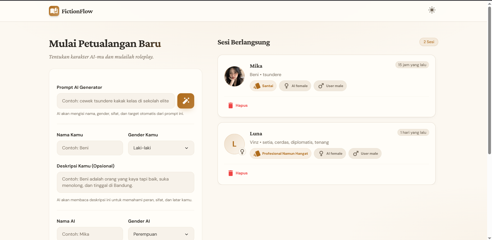
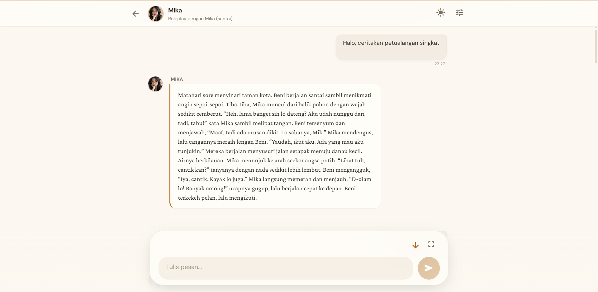
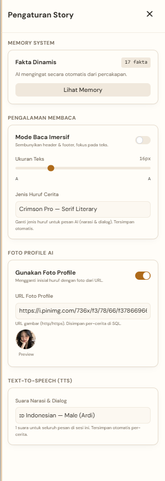

# FictionFlow

> Platform roleplay interaktif berbasis AI. Single-user, self-hosted, hemat RAM. Chat streaming real-time dengan TTS multi-voice dan long-term memory.



---

## ✨ Fitur Utama

| Fitur | Deskripsi |
|---|---|
| 🧠 **Two-Tier Memory** | Long-term (`dynamic_memory`, fakta inti cerita) + Short-term (N pesan terakhir ke LLM). AI tidak pernah lupa nama, sifat, atau target ending. |
| 📡 **Streaming Chat (SSE)** | Token demi token via event chain `meta` → `token`*N → `done`, abortable. |
| 🎙️ **Hybrid Multi-Voice TTS** | 4 Neural voices Microsoft Edge TTS (`id-ID-ArdiNeural/GadisNeural`, `en-US-GuyNeural/JennyNeural`) + prosody 4-tuple `(type × gender)` + Web Speech fallback. |
| 🛑 **Stop + Rollback** | Abort SSE, hapus bubble user+AI, restore teks ke chatbar, rollback atomik ke DB. |
| 🎨 **3 Tema** | `dark` / `light` / `coffee` (warm latte). |
| 🔌 **Pluggable Provider** | OpenRouter / 9Router / OpenAI-compatible. |
| 🔤 **Font Customization** | 6 font families (`serif`, `lora`, `slab`, `nunito`, `sans`, `system`) + adjustable size (14–22px) per story. |
| 📖 **Reading Mode** | Immersive view tanpa toolbar, toggle on/off per story. |
| 🖼️ **Avatar Profile** | Custom URL avatar + preview, enable/disable toggle, fallback ke initial huruf. |
| 📱 **PWA Ready** | Service worker (cache-first + stale-while-revalidate), manifest, icon 192/512. |
| 🤖 **Character Generator** | Auto-derive nama, kepribadian, gaya bahasa, dan target ending dari prompt singkat. |
| 🛡️ **Crash-safe** | `uncaughtException` filter — 403 dari Microsoft TTS endpoint tidak membunuh server. |

---

## 📸 Screenshots

<div align="center">
  
  
  
  <br/><sub>Dashboard · Chat Story dengan TTS toolbar · Settings drawer & memory manager</sub>
</div>

---

## 🚀 Quick Start

### Prasyarat

- **Node.js ≥ 18** ([download](https://nodejs.org))
- API key dari **OpenRouter** ([openrouter.ai](https://openrouter.ai)) — atau provider OpenAI-compatible lain

### Jalankan

```bash
cd /path/to/FictionFlow
npm start
```

Dev mode (backend auto-reload):

```bash
npm run dev
```

> `npm start` otomatis: install deps (kalau belum) → copy `.env.example` → cek API key → build CSS → start server. Buka **http://localhost:3000**.

---

## 🧩 Scripts Manual

```bash
npm install                       # Install backend + frontend (postinstall)
npm run build:css                 # Rebuild tailwind.output.css
npm run backend                   # Start backend saja (tanpa bootstrap)
npm run backend:dev               # Backend dengan node --watch
npm run seed                      # Seed DB
```

---

## 🗂️ Struktur Proyek

```
FictionFlow/
├── package.json                  # Root scripts (npm start / npm run dev)
├── scripts/run.mjs               # Bootstrap + start (cross-platform)
├── README.md                     # File ini
├── LICENSE                       # MIT
├── GEMINI.md                     # Gemini CLI config
├── data/                         # SQLite db auto-generated (gitignored)
├── docs/
│   ├── FictionFlow.md            # Spesifikasi lengkap (Bab 1–17)
│   ├── task.md                   # Task tracker
│   └── img/                      # Screenshots README
├── tests/                        # E2E & smoke test suite
│   ├── fictionflow-chat.spec.js
│   ├── test-chat-endpoint.mjs
│   ├── test-provider.mjs
│   └── test-story-stream.mjs
├── scratch/                      # One-off scripts & debug
│   ├── smoke.mjs                 # 13-endpoint E2E smoke
│   └── visual-test.js
│
├── backend/                      # Node.js + Express + SQLite
│   ├── package.json              # edge-tts-universal v1.4.0
│   ├── .env.example
│   └── src/
│       ├── server.js             # Entry point + crash filter
│       ├── app.js                # Express wiring + static serve
│       ├── config/               # env loader, fallback models
│       │   ├── env.js
│       │   └── fallbackModels.json
│       ├── db/                   # schema.sql, database.js, migrate.js, seed.js
│       ├── routes/               # stories, messages, models, tts, generator, voicePresets
│       ├── controllers/          # stories, messages (streamChat SSE), models
│       ├── services/             # promptBuilder (6-bagian), memoryManager, memoryExtractor,
│       │                         # modelProvider, edgeTts (+ test)
│       ├── middlewares/          # errorHandler (HttpError), requestLogger
│       └── util/                 # text (stripReasoningContent), time (normalizeTimestamps)
│
└── frontend/                     # Vanilla JS + Tailwind (static, no bundler)
    ├── tailwind.config.js
    ├── package.json              # Tailwind build deps only
    └── public/
        ├── index.html            # Dashboard page
        ├── story.html            # Story chat page
        ├── robots.txt
        ├── sw.js                 # Service worker (PWA)
        ├── manifest.webmanifest  # PWA manifest
        ├── css/
        │   ├── tailwind.input.css   # Source (edit here)
        │   └── tailwind.output.css  # Built (gitignored, wajib build:css)
        └── js/
            ├── api/
            │   └── apiClient.js     # REST + SSE + TTS client (single source)
            ├── core/
            │   ├── eventBus.js      # Events constants + on/off/emit
            │   ├── themeManager.js  # dark/light/coffee cycle singleton
            │   ├── markdownRenderer.js  # markdown-it wrapper
            │   ├── textUtils.js     # stripReasoningContent (shared)
            │   ├── ttsEngine.js     # Web Speech API wrapper
            │   └── ttsQueueManager.js   # Edge TTS queue + Audio playback + retry
            ├── pages/
            │   ├── dashboard.page.js    # Story list + create + character generator
            │   └── story.page.js        # Chat UI + TTS toolbar + settings + memory
            └── state/              # (reserved untuk future state management)
```

---

## 🛠️ API Reference

Base: `http://localhost:3000/api`

### Health & Models

| Method | Path | Deskripsi |
|---|---|---|
| `GET` | `/health` | Status server |
| `GET` | `/models` | Daftar model dari provider |

### Character Generator

| Method | Path | Body | Deskripsi |
|---|---|---|---|
| `POST` | `/generate/character` | `{prompt}` | Auto-derive karakter dari ide singkat |

### Stories CRUD

| Method | Path | Deskripsi |
|---|---|---|
| `POST` | `/stories` | Buat story baru |
| `GET` | `/stories` | List semua story |
| `GET` | `/stories/:id` | Detail story |
| `PATCH` | `/stories/:id` | Update (title, persona, model, avatar, font, voice, dll) |
| `DELETE` | `/stories/:id` | Soft-delete (arsip) |
| `DELETE` | `/stories/:id/permanent` | Hard-delete (cascade messages + TTS cache) |

### Messages & Chat

| Method | Path | Deskripsi |
|---|---|---|
| `GET` | `/stories/:id/messages` | Riwayat pesan (+ pagination `limit`/`offset`) |
| `POST` | `/stories/:id/messages` | Kirim pesan → SSE stream (`meta` → `token`*N → `done`) |
| `POST` | `/stories/:id/messages/fallback` | Fallback message saat provider error |
| `DELETE` | `/stories/:id/messages/rollback` | Rollback atomik: hapus user+AI msg + TTS cache + restore memory |

### TTS

| Method | Path | Deskripsi |
|---|---|---|
| `GET` | `/stories/:id/messages/tts-latest` | TTS cache terbaru (pre-populate replay) |
| `GET` | `/stories/:id/messages/:msgId/tts-cache` | TTS cache per message (owner check) |
| `POST` | `/tts` | Synthesize `{text, voice?, gender?}` → audio/mpeg |
| `POST` | `/tts/warmup` | Pre-warm TTS cache (fire-and-forget / blocking) |

### Voice Presets

| Method | Path | Deskripsi |
|---|---|---|
| `GET` | `/stories/:id/voice-presets` | List voice presets |
| `PATCH` | `/stories/:id/voice-presets/:tag` | Update voice preset |

---

## 🎙️ TTS & Audio System

AI membalas dengan struktur hybrid via 2 voice pack:

| Pack | Locale | Narration (male) | Dialogue (female) |
|---|---|---|---|
| Indonesian | `id-ID` | `ArdiNeural` | `GadisNeural` |
| English (US) | `en-US` | `GuyNeural` | `JennyNeural` |

### SSE Response Format

```jsonc
{
  "message_id": 17,
  "full_content": "Malam itu hujan turun perlahan...",
  "audio_segments": [
    { "text": "Malam itu...",       "gender": "male",   "type": "narration", "voice_config": {"locale":"id-ID","voice_name":"id-ID-ArdiNeural"} },
    { "text": "Kamu kenapa diam?",  "gender": "female", "type": "dialogue",  "voice_config": {"locale":"id-ID","voice_name":"id-ID-GadisNeural"} }
  ],
  "used_fallback_parse": false
}
```

### Pipeline

1. **Backend** `edgeTts.service.js` — `edge-tts-universal` v1.4.0 (Chrome 143 + MUID cookie auth), per-segment synthesis, prosody 4-tuple `(type × gender)`, 8s timeout, retry with backoff
2. **Frontend** `ttsQueueManager.js` — fetch via `apiClient.synthesizeTts()` → `<audio>` element, queue + skip/abort + 25s timeout + 3× retry + Blob URL lifecycle
3. **Fallback** → `window.speechSynthesis` per-segment di browser
4. **Cache** → `message_tts` table, replay tanpa re-synthesize, pre-populated saat load story

---

## 🛑 Stop Button & Rollback

```
[User kirim] → tombol send jadi stop (red tint), AbortController dibuat
       │
[SSE: meta] → userMessageId tercatat
[SSE: token*N] → bubble AI update real-time
       │
[User klik stop] →
  1. AbortController.abort() — cancel fetch
  2. Hapus bubble user + AI dari DOM
  3. Restore teks ke chatbar
  4. DELETE /messages/rollback (atomic transaction):
     - Hapus message_tts rows
     - Hapus messages (user + AI)
     - Restore dynamic_memory snapshot
```

---

## 🧠 Memory Engine

| Layer | Mekanisme |
|---|---|
| **Short-term** | N pesan terakhir (`short_term_window`, 3–5) dikirim ke LLM setiap request |
| **Long-term** | `extractAndMergeFacts` — LLM kedua ekstrak fakta dari user+AI message pair, merge + dedup (max 60 fakta), simpan ke `dynamic_memory` JSON |
| **4 Kategori Fakta** | `user`, `ai`, `world`, `relationship` |
| **Prompt Builder** | 6-bagian: Role → Output Spec → Voice Rules → Story Identity → Dynamic Facts → Output Rules |

---

## 🎨 Tema & Kustomisasi

- **3 Tema**: `dark` (default), `light`, `coffee` (warm latte) — migrasi otomatis dari `child` legacy
- **6 Font Families**: Serif, Lora, Slab, Nunito, Sans, System — dipilih per story
- **Font Size**: 14–22px slider per story
- **Reading Mode**: Immersive tanpa toolbar, independent toggle per story
- **Avatar**: URL custom + enable/disable toggle + instant preview + 2-KB size validation

---

## 🔐 Keamanan

- `MODEL_PROVIDER_API_KEY` hanya di backend, tidak pernah dikirim ke browser
- Data cerita tersimpan lokal di SQLite — no cloud sync
- Single-user, tanpa login. Untuk ekspos publik: tambahkan reverse-proxy + basic auth
- Input limits: `MAX_MESSAGE_CONTENT=20000`, per-field `STORY_FIELD_MAX_LENGTH`, body 1 MB
- Avatar URL validation: http/https only, max 2048 chars, valid URL parse

---

## 🧪 Testing

```powershell
# Start server test mode
$env:PORT = 3789; npm start --prefix backend

# Smoke test (13 endpoint)
node scratch/smoke.mjs
```

---

## 📜 Lisensi

[MIT](LICENSE)
