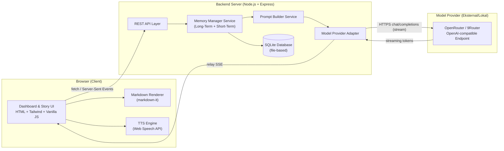
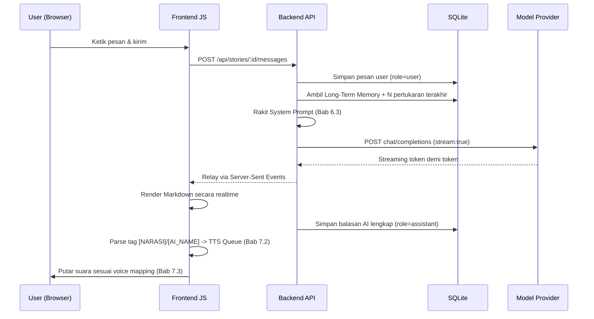

# FictionFlow — Dokumen Spesifikasi & Arsitektur Teknis

> **Status dokumen:** Blueprint / Planning Only — belum ada implementasi kode.
> **Tujuan dokumen:** Menjadi acuan tunggal (single source of truth) bagi AI generator (MiniMax) untuk membangun proyek ini tanpa ambiguitas.
> **Versi:** 1.0
> **Target rilis:** MVP (Minimum Viable Product) — single-user, self-hosted, RAM 4GB friendly.

---

## Daftar Isi

1. [Ringkasan Proyek](#1-ringkasan-proyek)
2. [Tech Stack Definitif](#2-tech-stack-definitif)
3. [Arsitektur Sistem Tingkat Tinggi](#3-arsitektur-sistem-tingkat-tinggi)
4. [Struktur Folder Proyek](#4-struktur-folder-proyek)
5. [Skema Database](#5-skema-database)
6. [Sistem Manajemen Memori Dua Tingkat](#6-sistem-manajemen-memori-dua-tingkat)
7. [Multi-Voice Text-to-Speech Engine](#7-multi-voice-text-to-speech-engine)
8. [UI/UX & Design System](#8-uiux--design-system)
9. [Spesifikasi API Endpoint](#9-spesifikasi-api-endpoint)
10. [Integrasi Model Provider (OpenRouter / 9Router)](#10-integrasi-model-provider-openrouter--9router)
11. [Environment Variables & Konfigurasi](#11-environment-variables--konfigurasi)
12. [Alur Kerja Request (Sequence Flow)](#12-alur-kerja-request-sequence-flow)
13. [Non-Functional Requirements](#13-non-functional-requirements)
14. [Keamanan & Privasi Data](#14-keamanan--privasi-data)
15. [Catatan Khusus untuk AI Generator (MiniMax)](#15-catatan-khusus-untuk-ai-generator-minimax)
16. [Roadmap Pengembangan](#16-roadmap-pengembangan)
17. [Lampiran: Contoh System Prompt Lengkap](#17-lampiran-contoh-system-prompt-lengkap)

---

## 1. Ringkasan Proyek

**Nama Proyek:** FictionFlow

**Deskripsi:** Platform web interaktif untuk bermain *interactive roleplay novel* berbasis AI. User mengonfigurasi identitas dirinya, identitas karakter AI lawan peran, gaya bahasa, dan target akhir cerita di awal — lalu bercerita secara bergiliran dengan AI, dengan narasi panjang yang dirender rapi (Markdown) dan dapat dibacakan otomatis dengan suara berbeda per karakter (multi-voice TTS).

**Karakteristik utama:**
- Single-user, self-hosted, dioptimalkan untuk VPS/komputer dengan RAM 4GB.
- Tidak memerlukan database server eksternal (pakai SQLite berbasis file).
- Tidak memerlukan framework frontend berat (Vanilla JS, tanpa bundler kompleks).
- Model AI bisa diganti bebas oleh user lewat dropdown (OpenRouter / 9Router / provider OpenAI-compatible lain).
- TTS 100% gratis memakai Web Speech API bawaan browser — tidak ada biaya API suara.

**Target pengguna:** Individu yang ingin menulis/menjalani cerita roleplay personal jangka panjang (puluhan-ratusan giliran chat) tanpa kehilangan konteks fakta inti cerita, dan tanpa membayar biaya TTS.

---

## 2. Tech Stack Definitif

> Spesifikasi awal memberi pilihan "Node.js (Express) **atau** Python (FastAPI)". Untuk menghindari ambiguitas saat eksekusi oleh AI generator, dokumen ini menetapkan **satu stack definitif**. Alternatif tetap dicatat sebagai catatan adaptasi.

| Layer | Pilihan Definitif | Alasan |
|---|---|---|
| Bahasa Backend | **Node.js (Express.js)** | Satu bahasa (JS) dari ujung ke ujung (FE+BE) memudahkan AI generator menjaga konsistensi. Native support untuk streaming (SSE) tanpa dependency tambahan. Footprint memori proses jauh lebih kecil dibanding Python+ASGI worker untuk kasus single-user. |
| Database | **SQLite** via `better-sqlite3` | File-based, tidak butuh proses server DB terpisah (hemat RAM). API sinkron sederhana, cocok untuk aplikasi single-user. |
| Frontend Markup | **HTML5 statis (multi-page, bukan SPA)** | Tanpa virtual DOM, tanpa build step kompleks → ringan dan cepat dimuat. |
| Styling | **Tailwind CSS** (di-build via Tailwind CLI ke file CSS statis, **bukan** CDN Play di production) | Utility-first, mudah dikustom untuk dark mode premium. CLI build menghindari overhead JIT compiler di browser saat runtime. |
| Interaktivitas | **Vanilla JavaScript (ES Modules)**, tanpa framework | Tidak ada runtime tambahan (React/Vue) yang membebani RAM/CPU client maupun build pipeline. |
| Markdown Rendering | **markdown-it** (client-side, ringan, ~30KB) | Mendukung bold/italic/blockquote yang dibutuhkan untuk narasi panjang. |
| Text-to-Speech | **Web Speech API (`SpeechSynthesis`)** bawaan browser | 100% gratis, tanpa request jaringan tambahan, tanpa biaya API. |
| Model AI Gateway | **OpenRouter** (default) — dapat diganti ke **9Router** (self-hosted) atau provider OpenAI-compatible lain | Keduanya menyediakan endpoint `chat/completions` bergaya OpenAI, sehingga cukup satu adapter generik (lihat Bab 10). |
| Proses Management | **PM2** (opsional untuk deployment) | Restart otomatis, monitoring RAM ringan. |

**Catatan adaptasi ke Python/FastAPI:** Jika di kemudian hari proyek dialihkan ke FastAPI, struktur folder Bab 4, skema DB Bab 5, dan seluruh kontrak API Bab 9 tetap berlaku — hanya implementasi internal (routing/ORM) yang berubah. Gunakan `aiosqlite` atau `sqlite3` standar Python sebagai pengganti `better-sqlite3`.

---

## 3. Arsitektur Sistem Tingkat Tinggi



**Komponen kunci:**
- **Memory Manager Service** — satu-satunya komponen yang berhak merakit isi konteks yang dikirim ke model AI (gabungan Long-Term + Short-Term Memory). Lihat Bab 6.
- **Model Provider Adapter** — lapisan abstraksi agar backend tidak peduli apakah ia memanggil OpenRouter, 9Router, atau provider lain — selama endpoint-nya kompatibel OpenAI. Lihat Bab 10.
- **TTS Engine** berjalan 100% di sisi client (browser), backend tidak terlibat sama sekali dalam proses suara.

---

## 4. Struktur Folder Proyek

```text
fictionflow/
├── backend/
│   ├── src/
│   │   ├── server.js                     # Entry point Express app
│   │   ├── config/
│   │   │   └── env.js                    # Load & validasi environment variables
│   │   ├── db/
│   │   │   ├── database.js               # Inisialisasi koneksi better-sqlite3
│   │   │   ├── schema.sql                # DDL skema database (lihat Bab 5)
│   │   │   └── migrations/               # (opsional) versi migrasi skema ke depan
│   │   ├── routes/
│   │   │   ├── stories.routes.js         # Routing /api/stories
│   │   │   ├── messages.routes.js        # Routing /api/stories/:id/messages
│   │   │   └── models.routes.js          # Routing /api/models
│   │   ├── controllers/
│   │   │   ├── stories.controller.js
│   │   │   ├── messages.controller.js
│   │   │   └── models.controller.js
│   │   ├── services/
│   │   │   ├── memoryManager.service.js  # Logika Bab 6 (rakit Long+Short Term Memory)
│   │   │   ├── modelProvider.service.js  # Adapter ke OpenRouter/9Router (Bab 10)
│   │   │   └── promptBuilder.service.js  # Render template System Prompt (Bab 6.4)
│   │   └── middlewares/
│   │       ├── errorHandler.js
│   │       └── requestLogger.js
│   ├── package.json
│   └── .env.example
│
├── frontend/
│   ├── public/
│   │   ├── index.html                    # Halaman 1: Dashboard / Konfigurasi Cerita Baru
│   │   ├── story.html                    # Halaman 2: Ruang Baca/Chat Interaktif
│   │   └── assets/
│   │       ├── fonts/                    # Font e-book (lihat Bab 8.3)
│   │       └── icons/
│   ├── css/
│   │   ├── tailwind.input.css            # Source Tailwind + custom dark theme tokens
│   │   └── tailwind.output.css           # Hasil build (digenerate, jangan diedit manual)
│   ├── js/
│   │   ├── api/
│   │   │   └── apiClient.js              # Wrapper fetch ke backend
│   │   ├── core/
│   │   │   ├── markdownRenderer.js       # Bungkus library markdown-it
│   │   │   ├── ttsEngine.js              # Modul inti Bab 7 (parsing tag + voice mapping)
│   │   │   └── ttsQueueManager.js        # Kontrol play/pause/stop/skip urutan suara
│   │   ├── pages/
│   │   │   ├── dashboard.page.js         # Logic form Halaman 1
│   │   │   └── story.page.js             # Logic render chat + tombol TTS per bubble
│   │   └── state/
│   │       └── storyState.js             # State management ringan (vanilla JS, tanpa Redux)
│   └── tailwind.config.js
│
├── docs/
│   └── FictionFlow.md                    # Dokumen ini
│
├── data/
│   └── fictionflow.sqlite                # File database (digenerate saat runtime)
│
├── .gitignore
└── README.md
```

---

## 5. Skema Database

> Mesin: SQLite. Library akses: `better-sqlite3`. Semua tabel didefinisikan di `backend/src/db/schema.sql`.

```sql
-- =========================================================
-- Tabel: stories
-- Wadah utama satu playthrough/cerita. Kolom di bagian
-- "LONG-TERM MEMORY" adalah Fakta Absolut — tidak pernah
-- dihapus otomatis, hanya bisa diedit manual oleh user.
-- =========================================================
CREATE TABLE stories (
    id                 TEXT PRIMARY KEY,                 -- UUID v4
    title              TEXT NOT NULL,                    -- Judul cerita (auto-generate / manual)
    created_at         DATETIME DEFAULT CURRENT_TIMESTAMP,
    updated_at         DATETIME DEFAULT CURRENT_TIMESTAMP,

    -- ====== LONG-TERM MEMORY (Tipe 1 — lihat Bab 6.1) ======
    user_name          TEXT NOT NULL,                    -- Nama persona User
    user_persona       TEXT,                              -- Deskripsi singkat peran User (opsional)
    ai_name            TEXT NOT NULL,                     -- Nama karakter AI, misal "Tika"/"Kaishi"
    ai_personality     TEXT NOT NULL,                     -- Sifat & karakteristik AI
    language_style     TEXT NOT NULL,                     -- 'santai' | 'ceplas_ceplos' | 'absurd' | 'kasar_imut'
    target_ending      TEXT NOT NULL,                     -- Target ending / plot twist yang diinginkan

    -- ====== Preferensi operasional ======
    active_model_id    TEXT NOT NULL DEFAULT 'openrouter/auto',  -- model terakhir dipilih di dropdown
    short_term_window  INTEGER NOT NULL DEFAULT 4,        -- jumlah pertukaran terakhir yg disuapkan (3-5)

    is_archived        INTEGER NOT NULL DEFAULT 0         -- soft delete flag (0/1)
);

-- =========================================================
-- Tabel: messages
-- Riwayat percakapan PENUH (untuk histori/export/tampilan UI).
-- Hanya N pesan terakhir yang diambil utk context window AI —
-- lihat algoritma di Bab 6.3. Tabel ini TIDAK pernah dipangkas.
-- =========================================================
CREATE TABLE messages (
    id              INTEGER PRIMARY KEY AUTOINCREMENT,
    story_id        TEXT NOT NULL REFERENCES stories(id) ON DELETE CASCADE,
    role            TEXT NOT NULL CHECK(role IN ('user','assistant')),
    raw_content     TEXT NOT NULL,                        -- konten asli lengkap dgn tag [NARASI]/[TIKA]/dst
    created_at      DATETIME DEFAULT CURRENT_TIMESTAMP,
    token_estimate  INTEGER DEFAULT 0                     -- estimasi jumlah token (monitoring budget)
);

CREATE INDEX idx_messages_story_created ON messages(story_id, created_at);

-- =========================================================
-- Tabel: voice_presets
-- Mapping tag karakter -> konfigurasi suara, per-story agar
-- bisa dikustomisasi user. Lihat Bab 7.3.
-- =========================================================
CREATE TABLE voice_presets (
    id              INTEGER PRIMARY KEY AUTOINCREMENT,
    story_id        TEXT NOT NULL REFERENCES stories(id) ON DELETE CASCADE,
    tag_name        TEXT NOT NULL,                        -- 'NARASI' | 'USER' | '<AI_NAME_UPPERCASE>'
    voice_uri_hint  TEXT,                                  -- preferensi nama suara browser (best-effort match)
    pitch           REAL NOT NULL DEFAULT 1.0,             -- rentang 0 - 2
    rate            REAL NOT NULL DEFAULT 1.0,             -- rentang 0.1 - 10
    gender_hint     TEXT CHECK(gender_hint IN ('male','female','neutral')),

    UNIQUE(story_id, tag_name)
);
```

---

## 6. Sistem Manajemen Memori Dua Tingkat

Ini adalah komponen paling kritis dari FictionFlow. Tujuannya: AI **tidak pernah lupa** fakta inti cerita, tetapi **tidak boros token** karena riwayat chat yang menumpuk.

### 6.1 Type 1 — Long-Term Memory ("Memori Selamanya")

- **Sumber data:** Diinput user satu kali di halaman Dashboard awal (Bab 8.1), disimpan di kolom-kolom tabel `stories` (Bab 5).
- **Isi:** Nama User, Persona User, Nama & Sifat Karakter AI, Gaya Bahasa, Target Ending/Plot Twist.
- **Sifat:** **Immutable secara default** — tidak ada mekanisme auto-delete maupun auto-summarize. User boleh mengeditnya secara manual lewat `PUT /api/stories/:id` (misal merevisi plot twist di tengah jalan), tapi sistem tidak pernah menghapusnya sendiri.
- **Penggunaan:** Disuntikkan ke **System Prompt** pada **SETIAP** request ke model AI, tanpa kecuali. Lihat template di Bab 6.4 dan Lampiran Bab 17.

### 6.2 Type 2 — Short-Term Memory ("Memori Singkat")

- **Sumber data:** Tabel `messages`, yaitu seluruh riwayat chat aktif dari satu story.
- **Window aktif:** Hanya **3-5 pertukaran terakhir** (1 pertukaran = 1 pesan user + 1 balasan AI) yang diikutkan ke payload yang dikirim ke model AI. Default: **4 pertukaran**, dapat dikonfigurasi per-story lewat kolom `short_term_window` (Bab 5).
- **Penting — bukan "dihapus dari database":** Pesan yang lebih lama dari window ini **tetap tersimpan permanen** di tabel `messages` (untuk keperluan tampilan histori penuh di UI dan kemungkinan fitur export di masa depan). Yang "di-wipe" hanyalah **payload aktif yang dikirim ke API model AI** — bukan datanya di database.
- **Efek:** Menghemat token secara signifikan pada cerita panjang (puluhan-ratusan giliran), sekaligus menjaga fokus AI ke konteks immediate, tanpa kehilangan fakta inti (karena fakta inti sudah dijamin oleh Long-Term Memory di Bab 6.1).

### 6.3 Algoritma Perakitan Context Payload

> Catatan: ini adalah **pseudocode spesifikasi**, bukan kode final. Implementasi detail diserahkan ke tahap coding, tapi logikanya **wajib** mengikuti urutan ini secara presisi.

```
FUNCTION buildContextPayload(story, latestUserMessage):

    // 1. Render System Prompt dari Long-Term Memory (Bab 6.1 + 6.4)
    systemPromptText = renderSystemPromptTemplate(
        ai_name           = story.ai_name,
        ai_personality    = story.ai_personality,
        user_name         = story.user_name,
        user_persona      = story.user_persona,
        language_style    = story.language_style,
        target_ending     = story.target_ending,
        tag_instruction   = generateTagInstruction(story.ai_name)   // lihat Bab 7.1
    )

    // 2. Ambil Short-Term Memory: N pertukaran terakhir saja (Bab 6.2)
    N = story.short_term_window                      // default 4, rentang valid 3-5
    recentMessages = QUERY messages
                     WHERE story_id = story.id
                     ORDER BY created_at DESC
                     LIMIT (N * 2)                    // x2 karena 1 pertukaran = 2 baris (user+assistant)
    recentMessages = REVERSE(recentMessages)          // urutkan kembali kronologis lama -> baru

    // 3. Gabungkan jadi payload final
    payload = [
        { role: "system", content: systemPromptText },
        ...MAP(recentMessages, m => ({ role: m.role, content: m.raw_content })),
        { role: "user", content: latestUserMessage }
    ]

    RETURN payload
END FUNCTION
```

### 6.4 Aturan Template System Prompt

Template lengkap (boilerplate teks) ada di **Lampiran Bab 17**. Ringkasan aturan wajib yang harus ada di dalam template:

1. Identitas AI (`ai_name`, `ai_personality`) dan identitas User (`user_name`, `user_persona`) harus dinyatakan eksplisit di awal prompt.
2. Instruksi gaya bahasa (`language_style`) harus diterjemahkan jadi instruksi konkret (lihat mapping di Bab 8.1).
3. Target ending dinyatakan sebagai arah cerita yang **harus dituju secara halus**, bukan dipaksakan kaku.
4. Instruksi format tag wajib (`[NARASI]`, `[<AI_NAME_UPPERCASE>]`) untuk kebutuhan parsing TTS di Bab 7 — ini WAJIB ada di setiap system prompt, karena tanpa tag ini, fitur TTS multi-suara tidak bisa berfungsi.

---

## 7. Multi-Voice Text-to-Speech Engine

Seluruh proses TTS berjalan **100% di sisi client (browser)** menggunakan `window.speechSynthesis`. Backend tidak terlibat sama sekali — ia hanya mengirim teks mentah (dengan tag) seperti biasa.

### 7.1 Konvensi Tag Karakter

- Setiap baris/paragraf output AI **wajib** diawali tag dalam kurung siku kapital, contoh: `[NARASI]`, `[TIKA]`, `[KAISHI]`.
- Tag untuk karakter AI **dinamis**, mengikuti `ai_name` yang dikonfigurasi user saat setup (di-uppercase). Sistem **tidak boleh** hardcode nama seperti "Tika" di kode — itu hanya contoh dari user.
- Tag `[USER]` tidak digunakan oleh AI (giliran User diisi User sendiri secara natural di kotak input, tanpa tag).
- Tag `[NARASI]` selalu tersedia sebagai default untuk narasi pihak ketiga/deskripsi suasana.

### 7.2 Algoritma Parsing Tag

```
FUNCTION parseTaggedSegments(rawText):
    pattern = /\[([A-Z0-9_]+)\]/g       // menangkap semua tag [XXXX] sebagai delimiter

    matches = findAllMatches(pattern, rawText)   // posisi & nama tag dalam teks
    segments = []

    FOR i FROM 0 TO length(matches) - 1:
        tagName   = matches[i].capturedName
        startPos  = endOfMatch(matches[i])
        endPos    = (i + 1 < length(matches)) ? startOfMatch(matches[i+1]) : length(rawText)
        textChunk = TRIM(substring(rawText, startPos, endPos))

        IF textChunk is not empty:
            segments.push({ tag: tagName, text: textChunk })

    RETURN segments
    // Contoh hasil:
    // [ { tag: "NARASI", text: "Malam itu hujan turun perlahan..." },
    //   { tag: "TIKA",   text: "Kamu kenapa diam terus dari tadi?" } ]
END FUNCTION
```

**Fallback:** Jika sebuah segmen teks tidak memiliki tag sama sekali (misal output model AI lupa menyertakan tag), seluruh teks tersebut **default jatuh ke voice profile `NARASI`** agar tidak error.

### 7.3 Skema Konfigurasi Voice Mapping

Disimpan di tabel `voice_presets` (Bab 5), dengan default berikut yang di-seed otomatis saat sebuah story dibuat:

```json
{
  "NARASI": {
    "genderHint": "neutral",
    "pitch": 1.0,
    "rate": 0.95,
    "voiceNameHint": ["Google Bahasa Indonesia", "Microsoft Andika"]
  },
  "USER": {
    "genderHint": "male",
    "pitch": 0.85,
    "rate": 1.0,
    "voiceNameHint": ["Google Bahasa Indonesia"]
  },
  "<AI_NAME_UPPERCASE>": {
    "genderHint": "female",
    "pitch": 1.45,
    "rate": 1.05,
    "voiceNameHint": ["Google Bahasa Indonesia", "Microsoft Zira"]
  }
}
```

> `"<AI_NAME_UPPERCASE>"` adalah placeholder yang digantikan runtime dengan nama AI sesungguhnya (misal `"TIKA"`) saat preset di-seed ke database. User dapat mengubah `pitch`, `rate`, dan `genderHint` masing-masing tag lewat panel Settings di UI.

### 7.4 Spesifikasi Modul Pemutar (TTS Queue Manager)

Modul `ttsQueueManager.js` bertanggung jawab atas:

1. **Enqueue berurutan** — setiap segmen hasil parsing (Bab 7.2) diubah jadi satu `SpeechSynthesisUtterance` dengan `voice`, `pitch`, `rate` sesuai mapping tag-nya (Bab 7.3).
2. **Playback sekuensial** — gunakan event `onend` dari setiap utterance untuk memicu `speak()` pada utterance berikutnya, **bukan** mengandalkan auto-queue browser secara polos, agar kontrol play/pause/stop/skip bisa diimplementasikan dengan presisi.
3. **Kontrol transport** — expose method `play()`, `pause()`, `resume()`, `stop()`, `skipToNext()`.
4. **Highlight visual (opsional, nice-to-have)** — tandai segmen teks yang sedang dibacakan di UI agar user bisa mengikuti pembacaan secara visual.
5. **Workaround browser quirk** — `speechSynthesis.pause()` dikenal tidak konsisten di beberapa versi Chrome untuk sesi panjang; sediakan fallback berupa "stop lalu mulai ulang dari index segmen saat ini" jika `pause()` terbukti tidak responsif.

### 7.5 Catatan Kompatibilitas Browser

- Daftar `SpeechSynthesisVoice` dimuat **secara asinkron**; wajib menunggu event `speechSynthesis.onvoiceschanged` sebelum mengisi dropdown pemilihan suara, agar tidak mendapat list kosong di Chrome.
- Ketersediaan suara berbahasa Indonesia bervariasi antar browser (umumnya lebih lengkap di Chrome/Edge dibanding Firefox/Safari). Jika `voiceNameHint` tidak ditemukan, sistem **wajib fallback** ke voice default browser dan tetap menerapkan `pitch`/`rate` yang dikonfigurasi — jangan biarkan TTS gagal total hanya karena nama suara spesifik tidak ada.

---

## 8. UI/UX & Design System

### 8.1 Daftar Halaman

| Halaman | File | Fungsi |
|---|---|---|
| **Dashboard / Setup** | `index.html` | Form konfigurasi awal sebelum cerita dimulai. Field wajib: **Siapa AI-nya** (nama + sifat karakter), **Siapa Saya/User** (nama + persona singkat), **Gaya Bahasa** (dropdown: Santai / Ceplas-ceplos / Absurd / Kasar tapi Imut), **Target Ending yang Diinginkan** (textarea). Submit → `POST /api/stories` → redirect ke `story.html?id=...`. |
| **Story / Reading Room** | `story.html` | Ruang baca-sekaligus-chat utama. Berisi: top bar (dropdown pemilihan model AI, toggle TTS on/off, tombol Settings), feed cerita bergulir (markdown-rendered, gaya e-book), input box di bawah, tombol play TTS per balasan AI. |
| **Settings Panel** (modal/overlay, bukan halaman terpisah) | terintegrasi di `story.html` | Override `short_term_window` (3-5), edit voice mapping per tag, edit Long-Term Memory (misal revisi target ending di tengah cerita). |

### 8.2 Mapping Pilihan Gaya Bahasa → Instruksi AI

| Pilihan UI | Instruksi yang disuntikkan ke System Prompt |
|---|---|
| Santai | Gunakan bahasa sehari-hari yang hangat dan rileks, hindari kata baku formal. |
| Ceplas-ceplos | Gunakan bahasa to-the-point, blak-blakan, tanpa basa-basi berlebihan. |
| Absurd | Selipkan humor absurd/komedi tak terduga dalam narasi maupun dialog. |
| Kasar tapi Imut | Gunakan nada ketus/julid yang playful (bukan menyakiti sungguhan), dipadukan ekspresi imut/menggemaskan. |

### 8.3 Design Tokens (Dark Mode Premium, E-Book Friendly)

| Token | Nilai | Catatan |
|---|---|---|
| `--bg-primary` | `#121417` | Hindari pure black (`#000000`) — kontras berlebih melelahkan mata saat baca lama. |
| `--bg-surface` | `#1C1F24` | Untuk card/panel/bubble chat. |
| `--text-primary` | `#E9E7E2` | Hindari pure white (`#FFFFFF`) demi kenyamanan mata. |
| `--text-secondary` | `#9AA0A6` | Untuk metadata, timestamp, label. |
| `--accent` | `#C9A65B` (gold premium) | Warna highlight tombol aktif, link, indikator TTS playing. |
| `--font-narrative` | `'Lora', 'Source Serif 4', serif` | Font body teks cerita — serif lebih nyaman untuk bacaan panjang. |
| `--font-ui` | `'Inter', 'Plus Jakarta Sans', sans-serif` | Font tombol, label, navigasi. |
| `line-height` (narasi) | `1.75` – `1.85` | Spasi antar-baris lega, mengurangi kelelahan mata. |
| `max-width` kolom konten | `680px` – `720px` | Lebar baca optimal, mencegah mata "tersesat" di baris yang terlalu panjang. |
| `font-size` dasar (narasi) | `17px` – `18px` | Ukuran nyaman untuk sesi baca berjam-jam. |

### 8.4 Aturan Rendering Markdown untuk Narasi

| Sintaks Markdown | Makna Naratif | Treatment Visual |
|---|---|---|
| `**tebal**` | Aksi/tindakan penting | `font-weight: 600`, warna sedikit lebih terang dari `--text-primary`. |
| `_miring_` | Monolog batin/pikiran karakter | `font-style: italic`, warna `--text-secondary`, opsional sedikit indentasi kiri. |
| Baris berawalan `"` (dialog) | Ucapan langsung | Ditampilkan dalam blok dengan left-border tipis warna `--accent` + padding kiri, agar dialog mudah dipisah secara visual dari narasi biasa. |

---

## 9. Spesifikasi API Endpoint

| Method | Path | Deskripsi | Request Body | Response |
|---|---|---|---|---|
| `POST` | `/api/stories` | Buat story baru + Long-Term Memory awal | `{ user_name, user_persona, ai_name, ai_personality, language_style, target_ending }` | `{ story_id, ...story }` |
| `GET` | `/api/stories/:id` | Ambil detail satu story | – | `{ story }` |
| `PUT` | `/api/stories/:id` | Edit field Long-Term Memory tertentu | `{ ...field yang diubah }` | `{ story }` |
| `DELETE` | `/api/stories/:id` | Hapus story (soft delete) | – | `{ success: true }` |
| `GET` | `/api/stories/:id/messages` | Ambil seluruh riwayat chat untuk ditampilkan di UI (bukan untuk context AI) | query: `?limit=&offset=` | `{ messages: [...] }` |
| `POST` | `/api/stories/:id/messages` | Kirim pesan User; backend merakit context (Bab 6.3), memanggil model AI, mem-streaming balasan | `{ content, model_id }` | **SSE stream** token demi token; event akhir berisi `{ message_id, full_content }` |
| `GET` | `/api/models` | Daftar model yang tersedia dari provider aktif (untuk isi dropdown) | – | `{ models: [{ id, label, provider }] }` |
| `GET` | `/api/stories/:id/voice-presets` | Ambil konfigurasi voice mapping story tersebut | – | `{ presets: [...] }` |
| `PUT` | `/api/stories/:id/voice-presets/:tag` | Update pitch/rate/gender_hint untuk satu tag suara | `{ pitch, rate, gender_hint, voice_uri_hint }` | `{ preset }` |

---

## 10. Integrasi Model Provider (OpenRouter / 9Router)

### 10.1 Prinsip Abstraksi

Baik **OpenRouter** maupun **9Router** sama-sama mengekspos endpoint yang **kompatibel dengan format OpenAI Chat Completions** (`POST {base_url}/chat/completions`, payload `{ model, messages, stream }`). Karena itu, backend FictionFlow **hanya membutuhkan satu adapter generik** (`modelProvider.service.js`) yang dikonfigurasi lewat dua environment variable: base URL dan API key — tanpa logic khusus per-provider.

| Provider | Base URL Default | Catatan |
|---|---|---|
| OpenRouter | `https://openrouter.ai/api/v1` | Layanan cloud publik, butuh API key berbayar/saldo sesuai model yang dipilih. |
| 9Router | `http://localhost:20128/v1` (default saat dijalankan lokal) | Proxy open-source yang di-self-host oleh user, meneruskan request ke berbagai provider (termasuk opsi gratis) dengan auto-fallback. Cukup ganti `MODEL_PROVIDER_BASE_URL` ke alamat ini — tidak perlu ubah kode lain. |

### 10.2 Daftar Model Dinamis (Dropdown Selector)

- Endpoint `GET /api/models` di backend **meneruskan** request ke `{base_url}/models` milik provider aktif (jika provider mendukung listing endpoint ini).
- **Fallback wajib:** jika provider tidak menyediakan endpoint listing model, backend mengembalikan daftar statis minimal (curated list) yang dapat dikonfigurasi lewat file `backend/src/config/fallbackModels.json` — bukan di-hardcode di logic, agar mudah diperbarui tanpa mengubah kode.
- Dropdown di frontend (`story.page.js`) memuat daftar ini, dan setiap kali user memilih model, `active_model_id` pada story tersebut diperbarui via `PUT /api/stories/:id`.

### 10.3 Format Request ke Model Provider

```json
{
  "model": "{{model_id_dari_dropdown}}",
  "messages": "{{payload_dari_Bab_6.3}}",
  "stream": true
}
```

Header wajib: `Authorization: Bearer {{MODEL_PROVIDER_API_KEY}}` dan `Content-Type: application/json`.

---

## 11. Environment Variables & Konfigurasi

```dotenv
# .env.example

# ---- Server ----
PORT=3000
NODE_ENV=production

# ---- Database ----
DB_PATH=./data/fictionflow.sqlite

# ---- Model Provider ----
# Default: OpenRouter. Ganti ke http://localhost:20128/v1 jika memakai 9Router lokal.
MODEL_PROVIDER_BASE_URL=https://openrouter.ai/api/v1
MODEL_PROVIDER_API_KEY=sk-xxxxxxxxxxxxxxxx
DEFAULT_MODEL_ID=openrouter/auto

# ---- Memory ----
# Jumlah pertukaran (user+AI) terakhir yang disuapkan ke context AI. Rentang disarankan: 3-5.
DEFAULT_SHORT_TERM_WINDOW=4
```

---

## 12. Alur Kerja Request (Sequence Flow)



---

## 13. Non-Functional Requirements

- **Target RAM total runtime (idle, single-user):** ≤ 250MB untuk proses backend Node.js + SQLite. Hindari dependency berat (ORM dengan binary engine besar seperti Prisma, framework SSR penuh seperti Next.js).
- **Tidak ada in-memory caching besar** — semua state persisten harus langsung ke SQLite, jangan menumpuk riwayat chat di memori proses Node.js.
- **Frontend tanpa bundler kompleks** — gunakan ES Modules native browser (`<script type="module">`), hindari webpack/vite kecuali sekadar build Tailwind CSS.
- **Tailwind di-build sebagai file statis** (`tailwind.output.css`) saat deployment, **jangan** memuat `cdn.tailwindcss.com` di production (JIT compiler runtime di browser membebani CPU client tanpa perlu).
- **Pagination wajib** pada `GET /api/stories/:id/messages` agar UI tidak memuat seluruh riwayat sekaligus pada cerita yang sudah sangat panjang.
- **Browser target:** Chrome/Edge versi terbaru sebagai prioritas utama (dukungan Web Speech API paling matang); Firefox/Safari didukung dengan graceful fallback (Bab 7.5).

---

## 14. Keamanan & Privasi Data

- `MODEL_PROVIDER_API_KEY` **hanya** disimpan di `.env` backend, **tidak pernah** dikirim atau diekspos ke frontend/browser. Semua panggilan ke model AI **wajib** lewat backend sebagai proxy.
- Data story (termasuk Long-Term Memory) disimpan lokal di file SQLite — tidak ada sinkronisasi cloud di MVP, sehingga data sepenuhnya berada di kendali user.
- Untuk MVP, tidak ada sistem login/akun (single-user lokal). Jika aplikasi di-deploy agar dapat diakses dari internet publik, **wajib** ditambahkan rate-limiting middleware sederhana sebagai mitigasi dasar — detail implementasi otentikasi penuh berada di luar scope MVP (lihat Roadmap V2, Bab 16).

---

## 15. Catatan Khusus untuk AI Generator (MiniMax)

**WAJIB DIIKUTI:**
- Ikuti struktur folder di Bab 4 secara presisi — jangan menambah/menghilangkan layer tanpa alasan kuat.
- Implementasikan skema tabel di Bab 5 sesuai persis nama kolom dan tipenya (penyesuaian tipe data SQLite minor diperbolehkan, mis. `DATETIME` disimpan sebagai `TEXT` ISO8601 — itu wajar di SQLite).
- Logika perakitan context **harus** mengikuti algoritma Bab 6.3 langkah demi langkah — ini jantung dari fitur "memori dua tingkat" yang dijual ke user.
- Parsing tag TTS **harus** mengikuti regex & algoritma Bab 7.2 — jangan diganti pendekatan lain (misal split by newline saja) karena akan merusak akurasi pemisahan suara.
- Endpoint chat (`POST /api/stories/:id/messages`) **harus** streaming (SSE), bukan response tunggal yang menunggu seluruh balasan selesai — narasi AI bisa panjang, dan UX baca jadi buruk tanpa streaming.

**JANGAN DILAKUKAN:**
- Jangan menambahkan framework frontend berat (React/Vue/Svelte/Next.js) — spesifikasi ini secara eksplisit meminta Vanilla JS demi RAM 4GB friendly.
- Jangan menggunakan ORM berat (Prisma/TypeORM/Sequelize) — cukup `better-sqlite3` dengan raw SQL query sesuai skema Bab 5.
- Jangan hardcode nama karakter contoh seperti `"Tika"` atau `"Kaishi"` di dalam source code mana pun — nama-nama itu hanyalah contoh dari user, semua harus dinamis berdasarkan input `ai_name` dari database.
- Jangan mengekspos `MODEL_PROVIDER_API_KEY` ke kode frontend/browser dalam bentuk apa pun.
- Jangan membangun sistem autentikasi/login penuh di MVP — itu di luar scope V1 (lihat Bab 16).
- Jangan memuat `cdn.tailwindcss.com` di file HTML production — gunakan hasil build CLI statis.

---

## 16. Roadmap Pengembangan

### V1 — MVP (scope dokumen ini)
- Seluruh fitur Bab 1–15 di atas.
- Single-user, self-hosted, tanpa autentikasi.
- Database SQLite lokal, tanpa sinkronisasi cloud.

### V2 — Pengembangan Lanjutan (di luar scope saat ini, jangan dikerjakan dulu)
- Multi-user + sistem autentikasi (login/register).
- Export cerita ke format PDF/EPUB.
- Voice cloning kustom (di luar Web Speech API bawaan browser).
- Generasi gambar/avatar karakter (image generation).
- Sinkronisasi cloud antar-device.

---

## 17. Lampiran: Contoh System Prompt Lengkap

> Ini adalah **contoh isi/konten** template yang dirender oleh `promptBuilder.service.js` (Bab 6.4) — bukan kode aplikasi, melainkan teks yang dikirim sebagai `role: "system"` ke model AI.

```text
Kamu adalah AI Roleplay Generator untuk aplikasi FictionFlow. Tugasmu adalah
melanjutkan sebuah cerita interaktif bersama User, mengikuti aturan berikut
TANPA PERNAH MELANGGARNYA:

=== IDENTITAS TETAP (FAKTA ABSOLUT — JANGAN PERNAH DIUBAH SENDIRI) ===
- Nama Karakter AI kamu      : {{ai_name}}
- Sifat & Karakteristik      : {{ai_personality}}
- Nama User (lawan peranmu)  : {{user_name}}
- Deskripsi Peran User       : {{user_persona}}
- Gaya Bahasa yang dipakai   : {{language_style_instruction}}
- Target Akhir Cerita        : {{target_ending}}
  (Arahkan plot secara halus ke sini sepanjang cerita berjalan, jangan
  dipaksakan kaku atau terasa tiba-tiba.)

=== ATURAN FORMAT OUTPUT (WAJIB — untuk sistem Text-to-Speech) ===
Setiap baris/paragraf yang kamu tulis WAJIB diawali salah satu tag berikut:
- [NARASI]              -> deskripsi suasana, aksi, atau sudut pandang narator
- [{{ai_name_upper}}]   -> dialog yang diucapkan oleh karakter {{ai_name}}

Jangan pernah menulis tag [USER] — giliran User akan diisi oleh User sendiri.
Jangan keluar dari format tag ini dalam kondisi apapun, termasuk saat
menulis monolog batin karakter (tetap pakai tag yang sesuai).

=== ATURAN PENULISAN ===
- Gunakan **teks tebal** untuk menekankan aksi/tindakan penting.
- Gunakan _teks miring_ untuk monolog batin/pikiran karakter.
- Pisahkan setiap dialog dengan baris baru agar mudah dibaca dan diparsing.

Lanjutkan cerita berdasarkan riwayat percakapan yang akan diberikan setelah ini.
```

---

*Akhir dokumen. Siap diteruskan ke AI generator (MiniMax) untuk tahap implementasi kode.*
